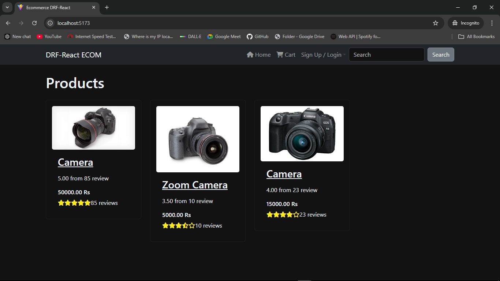
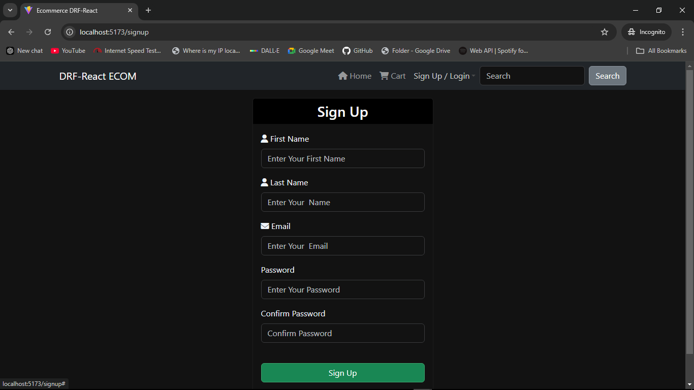
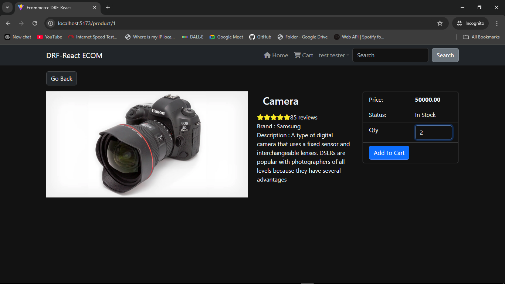
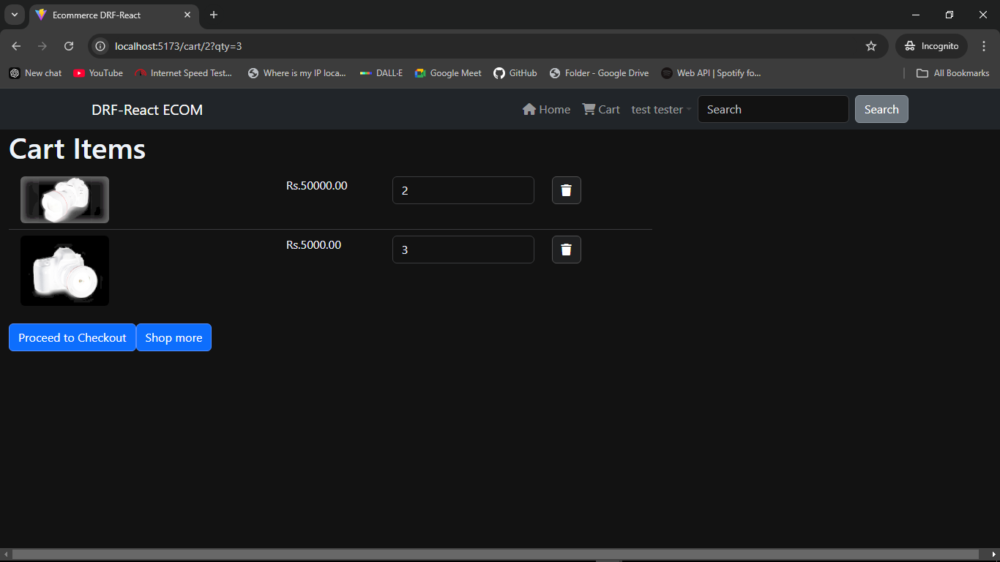
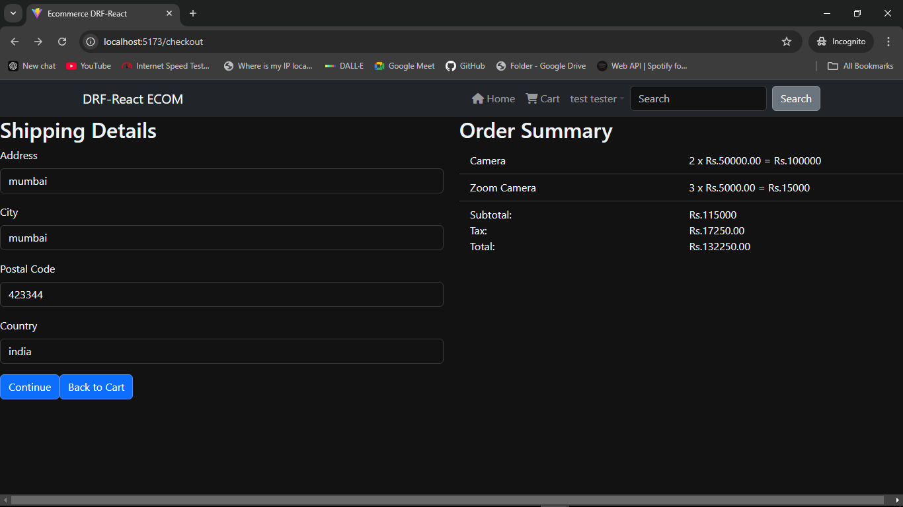
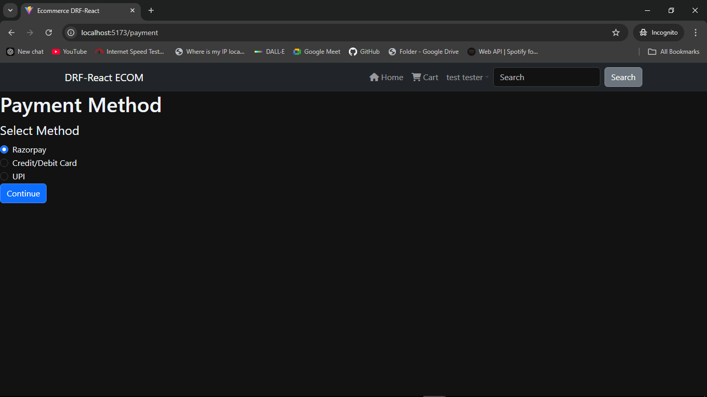
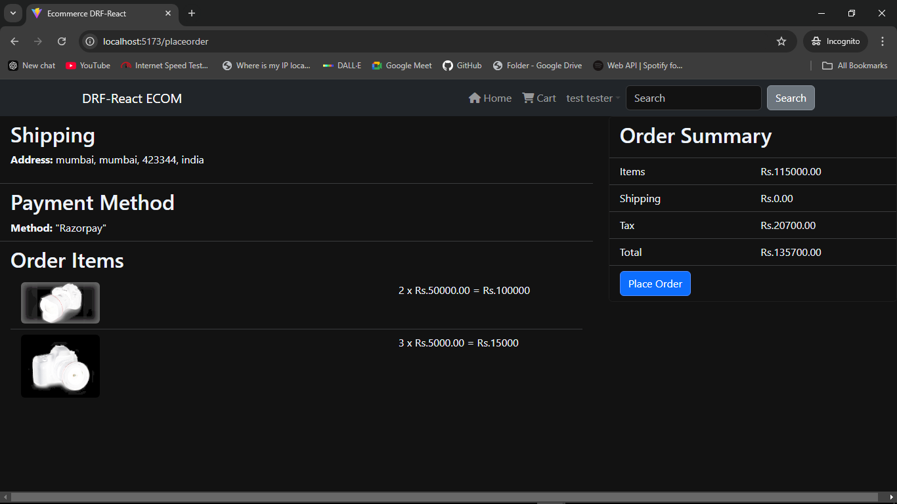
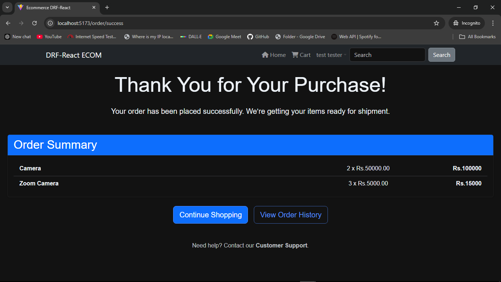
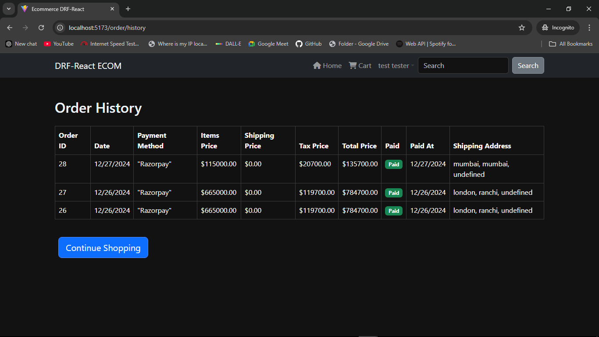

# eCommerce Website

## Description

A full-stack eCommerce website built with React (frontend) and Django (backend). It allows users to browse products, add them to the cart, place an order and view order history.

## Features

- User authentication (login, registration, logout)
- Product catalog with search functionality
- Shopping cart and checkout process
- Order history

## Technologies Used

- React.js
- Django
- Redux
- HTML/CSS/JS/BOOTSTRAP

## Installation

1. Clone this repository: `git clone https://github.com/username/ecommerce-website.git`
2. Navigate to the `frontend` directory and install dependencies: `npm install`
3. Set up the Django backend:
   - Create a virtual environment: `python -m venv myenv`
   - Activate the environment: `source myenv/bin/activate` (Linux/macOS) or `myenv\Scripts\activate` (Windows)
   - Install requirements: `pip install -r backend/requirements.txt`
4. Run the development server:
   - Frontend: `npm start`
   - Backend: `python manage.py runserver`

## Screenshots

## Future Enhancements

- Integration of Stripe payment gateway
- User review system
